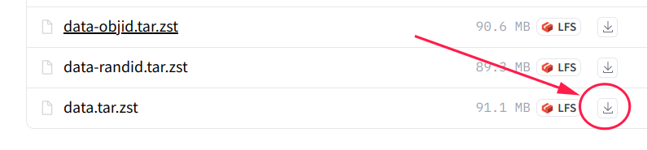

# Data

## Data location

Our data are hosted on [Huggingface](https://huggingface.co/mango-ttic).
We provide access to the following collections:

| Name | Description | Purpose | variations |
| --------------- | ----------- | ------- | -------- |
| [data](https://huggingface.co/datasets/mango-ttic/data) | A cleaned collection that only contains test-ready releases | Good for LLM benchmark | - data <br> - data-objid <br> - data-randid |
| [data-intermediate](https://huggingface.co/datasets/mango-ttic/data-intermediate) | A full collection with all of our labeling and intermediate files | If you are interested in dig deeper into data labeling, or derive further customized version | - data-intermediate <br> - data-intermediate-objid <br> - data-intermediate-randid |

*note:* if your connection to huggingface.co is slow, you can find us on [Huggingface mirror](https://hf-mirror.com/mango-ttic)

## Folder Structure

Each folder inside `data` contains the cleaned up files used during LLM inference and results evaluations. Here is the tree structure from game `data/night` .

```bash
data/night/
├── night.actions.json      # list of mentioned actions
├── night.all2all.json      # all simple paths between any 2 locations
├── night.all_pairs.json    # all connectivity between any 2 locations
├── night.edges.json        # list of all edges
├── night.locations.json    # list of all locations
└── night.walkthrough       # enriched walkthrough exported from Jericho simulator
```

Each folder inside `data-intermediate` contains
all intermediate files we used during data annotation and generation. Here is the tree structure from game `data-intermediate/night` .

```bash
data-intermediate/night/
├── night.all2all.json      # all simple paths between any 2 nodes
├── night.all_pairs.json    # all connectivity between any 2 nodes 
├── night.anno2code.json    # annotation to codename mapping
├── night.code2anno.json    # codename to annotation mapping
├── night.edges.json        # list of all edges
├── night.map.human         # human map derived from human annotation
├── night.map.machine       # machine map derived from exported action sequences
├── night.map.reversed      # reverse map derived from human annotation map
├── night.moves             # list of mentioned actions
├── night.nodes.json        # list of all nodes
├── night.valid_moves.csv   # human annotation
├── night.walkthrough       # enriched walkthrough exported from Jericho simulator
└── night.walkthrough_acts  # action sequences exported from Jericho simulator
```

## Variations

### 70-step vs all-step version

In our paper, we benchmark using the first 70 steps of the walkthrough from each game. We also provide all-step versions of both `data` and `data-intermediate` collection.

* **70-step** `data[-intermediate]-70steps.tar.zst`: contains the first 70 steps of each walkthrough. If the complete walkthrough is shorter than 70 steps, then all steps are used.

* **All-step** `data[-intermediate].tar.zst`: contains all steps of each walkthrough.

### Word-only & Word+ID

* **Word-only** `data[-intermediate].tar.zst`: Nodes are annotated by additional descriptive text to distinguish different locations with similar names.

* **Word + Object ID** `data[-intermediate]-objid.tar.zst`:  variation of the word-only version, where nodes are labeled using minimaly fixed names with object id from Jericho simulator.

* **Word + Random ID** `data[-intermediate]-randid.tar.zst`: variation of the Jericho ID version, where the Jericho object id replaced with randomly generated integer.

We primarily rely on the **word-only** version as benchmark, yet providing word+ID version for diverse benchmark settings.

## How to use

We use `data.tar.zst` as an example here.

### 1. download from Huggingface

#### by directly download



#### by git

Make sure you have [git-lfs](https://git-lfs.com) installed

```bash
git lfs install
git clone https://huggingface.co/datasets/mango-ttic/data

# or, use hf-mirror if your connection to huggingface.co is slow
# git clone https://hf-mirror.com/datasets/mango-ttic/data
```

### 2. decompress

Because some json files are huge, we use tar.zst to package the data.

silently decompress

```bash
tar -I 'zstd -d' -xf data.tar.zst
```

or, verbosely decompress

```bash
zstd -d -c data.tar.zst | tar -xvf -
```
