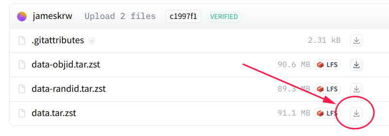

# Data

## Data location

Our data are hosted on [Huggingface](https://huggingface.co/mango-ttic).
We provide access to the following collections:

| Name | Description | Purpose | variations |
| --------------- | ----------- | ------- | -------- |
| [data/huggingface](https://huggingface.co/datasets/mango-ttic/data) | A cleaned collection that only contains test-ready releases | Good for LLM benchmark | - data.tar.zst <br> - data-objid.tar.zst <br> - data-randid.tar.zst |
| [data-intermediate/huggingface](https://huggingface.co/datasets/mango-ttic/data-intermediate) | A full collection with all of our labeling and intermediate files | If you are interested in dig deeper into data labeling, or derive further customized version | - data-intermediate.tar.zst <br> - data-intermediate-objid.tar.zst <br> - data-intermediate-randid.tar.zst |

*note:* if your connection to huggingface.co is slow, you can find us on [Huggingface mirror](https://hf-mirror.com/mango-ttic)

## Variations

### 70-step vs all-step version

In our paper, we benchmark using the first 70 steps of the walkthrough from each game. We also provide all-step versions of both `data` and `data-intermediate` collection.

### Word-only & Word+ID

* **word-only** `data[-intermediate].tar.zst`: We have one version where all nodes are labeled by additional descriptive text to distinguish different locations with similar names. 

* **word + jericho ID** `data[-intermediate]-objid.tar.zst`: In addition, we also prepared another version, where nodes are labeled using minimaly fixed names with object id from Jericho simulator.

* **word + random ID** `data[-intermediate]-randid.tar.zst`: A variation of the Jericho ID version, where the Jericho object id replaced with randomly generated integer.

We primarily rely on the word-only version as benchmark, yet providing word+ID version for diverse benchmark settings.

## How to use

Because some json files are huge, we use tar.zst to package the data.

### 1. Download `data` from Huggingface

#### by directly download



#### by git

Make sure you have git-lfs installed (https://git-lfs.com)

```bash
git lfs install
git clone https://huggingface.co/datasets/mango-ttic/data
# or, use hf-mirror if your connection to huggingface.co is slow
# git clone https://hf-mirror.com/datasets/mango-ttic/data
```

If you want to clone without large files - just their pointers

```bash
GIT_LFS_SKIP_SMUDGE=1 git clone https://huggingface.co/datasets/mango-ttic/data
# or
# GIT_LFS_SKIP_SMUDGE=1 git clone https://hf-mirror.com/datasets/mango-ttic/data
```

### 2. Decompress to `your_folder`

Before decompressing the data, make sure `your_folder` exists. If not, create it by `mkdir -p your_folder` .

Some files are large, please be patient.

silently decompress

```bash
tar -I 'zstd -d' -xf data.tar.zst -C your_folder
```

or, verbosely decompress

```bash
zstd -d -c data.tar.zst | tar -xvf - -C your_folder
```
