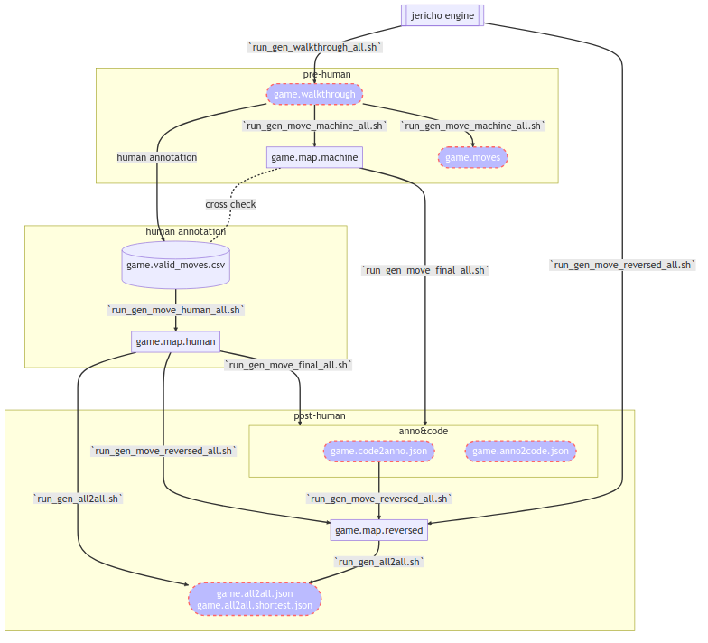

<!-- TOC -->

- [How to use](#how-to-use)
    - [1. Install](#1-install)
    - [2. Run](#2-run)
        - [2.1. 生成一个游戏的 game.map.human, game.anno2code.json, game.anno2code.json](#21-%E7%94%9F%E6%88%90%E4%B8%80%E4%B8%AA%E6%B8%B8%E6%88%8F%E7%9A%84-gamemaphuman-gameanno2codejson-gameanno2codejson)
        - [2.2. 生成所有游戏的 game.map.human, game.anno2code.json, game.anno2code.json](#22-%E7%94%9F%E6%88%90%E6%89%80%E6%9C%89%E6%B8%B8%E6%88%8F%E7%9A%84-gamemaphuman-gameanno2codejson-gameanno2codejson)
    - [3. pipeline](#3-pipeline)

<!-- /TOC -->

# How to use

## Install

```bash
mkdir gamegpt
cd gamegpt

# 下载 jericho 游戏
wget https://github.com/BYU-PCCL/z-machine-games/archive/master.zip
unzip master.zip

# 克隆 gamegpt_utils 仓库
git clone git@github.com:Oaklight/gamegpt_utils.git
cd gamegpt_utils

# 切换到 gen_map 分支
git checkout gen_map

# 安装依赖
pip install -r requirements.txt
python -m spacy download en_core_web_sm
```

记住这个z-machine-games-master的路径，后面会用到。

我的文件夹结构是这样的， 供你参考

```bash
- gamegpt
    - gamegpt_utils
        - data/maps
            - game1
            - game2
            - ...
        - data_old
        - scripts
            - gen_moves
        - src
            - gen_moves
            - gen_paths
    - z-machine-games-master
        - jericho-game-suite
            - game1
            - game2
            - ...
        - ...
```

## Run

### 生成一个游戏的 game.map.human, game.anno2code.json, game.anno2code.json

```bash
cd gamegpt_utils
./scripts/gen_moves/run_gen_move_human_to_all.sh -p <path> -g <game> -j <jericho_path>
```

，包括：

- path: 一般情况是指`data/maps`，具体path取决于在哪里运行这个脚本：如果在gamegpt_utils执行，则为`data/maps`，如果在scripts执行，则为`../data/maps`；
- game: 具体folder的名字，比如zork1、905；
- jericho_path: jericho游戏的位置，比如：`z-machine-games-master/jericho-game-suite`，具体path取决于哪里运行，参考path的解释。

对应游戏生成的结果在`data/maps/<game>`下面

### 生成所有游戏的 game.map.human, game.anno2code.json, game.anno2code.json

如果想要生成所有的游戏，可以运行：

```bash
cd gamegpt_utils

# 先生成 game.map.human，仅对存在 game.valid_moves.csv 的文件夹操作
./scripts/gen_moves/run_gen_move_human_all.sh -p <path> -j <jericho_path>

# 再此基础上生成 game.anno2code.json, game.anno2code.json， 仅对 game.map.human 存在的文件夹操作
./scripts/gen_moves/run_gen_move_final_all.sh -p <path> -j <jericho_path>
```

## pipeline

对于每个游戏，我们有如下的工作流程：


