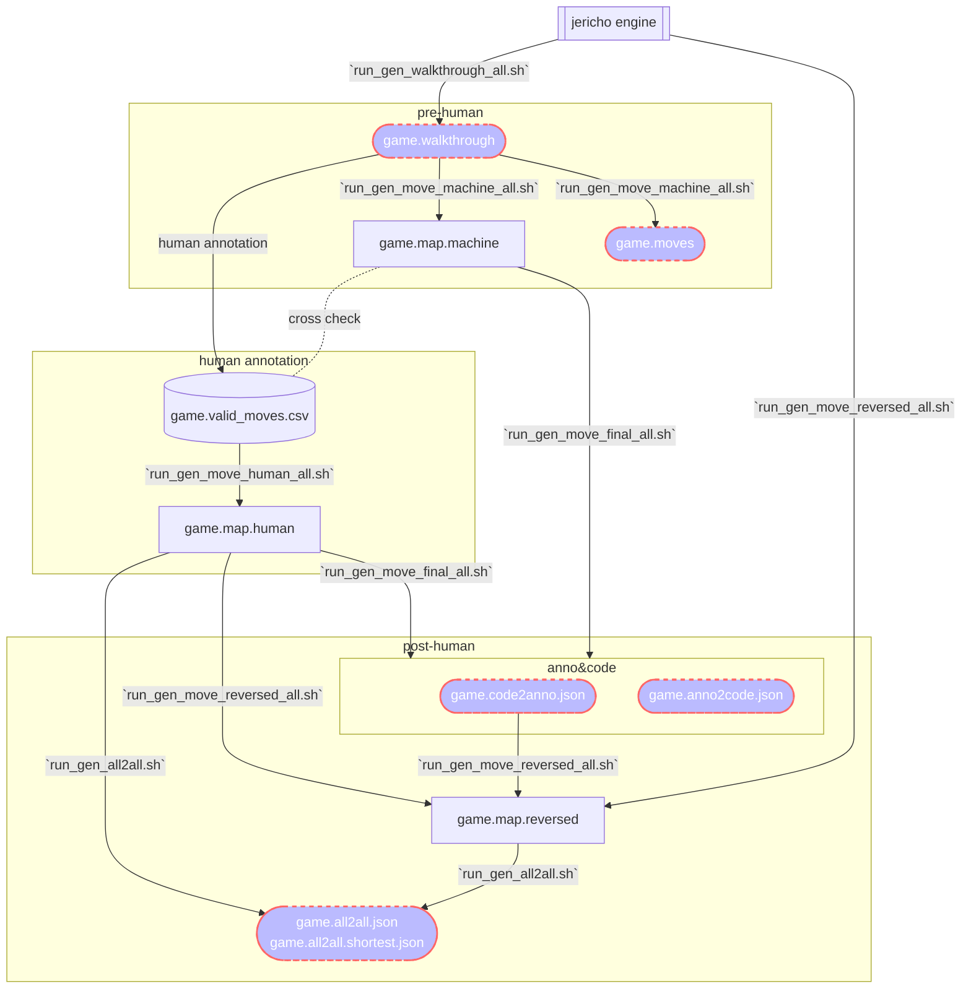

```mermaid
flowchart TB
A[[jericho engine]] --> |`run_gen_walkthrough_all.sh`| B([game.walkthrough])
B --> |human annotation| C[(game.valid_moves.csv)]
B --> |`run_gen_move_machine_all.sh`| D[game.map.machine] & E([game.moves])
C --> |`run_gen_move_human_all.sh`| F[game.map.human]
D -.- |cross check| C
D & F --> |`run_gen_move_final_all.sh`| anno&code
H & F --> |`run_gen_all2all.sh`| I([game.all2all.json \n game.all2all.shortest.json])
F & J & A --> |`run_gen_move_reversed_all.sh`| H[game.map.reversed]

subgraph "pre-human"
B
E
D
end

subgraph "post-human"
    subgraph anno&code
    J([game.code2anno.json])
    G([game.anno2code.json])
    end
H
I
end

subgraph "human annotation"
F
C
end

style B fill:#bbf,stroke:#f66,stroke-width:2px,color:#fff,stroke-dasharray: 5 5
style E fill:#bbf,stroke:#f66,stroke-width:2px,color:#fff,stroke-dasharray: 5 5
style G fill:#bbf,stroke:#f66,stroke-width:2px,color:#fff,stroke-dasharray: 5 5
style J fill:#bbf,stroke:#f66,stroke-width:2px,color:#fff,stroke-dasharray: 5 5
style I fill:#bbf,stroke:#f66,stroke-width:2px,color:#fff,stroke-dasharray: 5 5
```